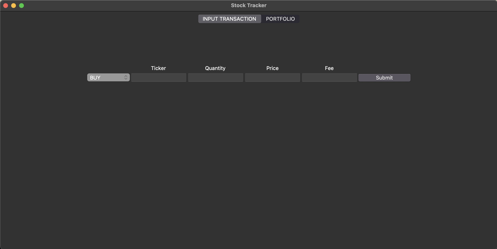
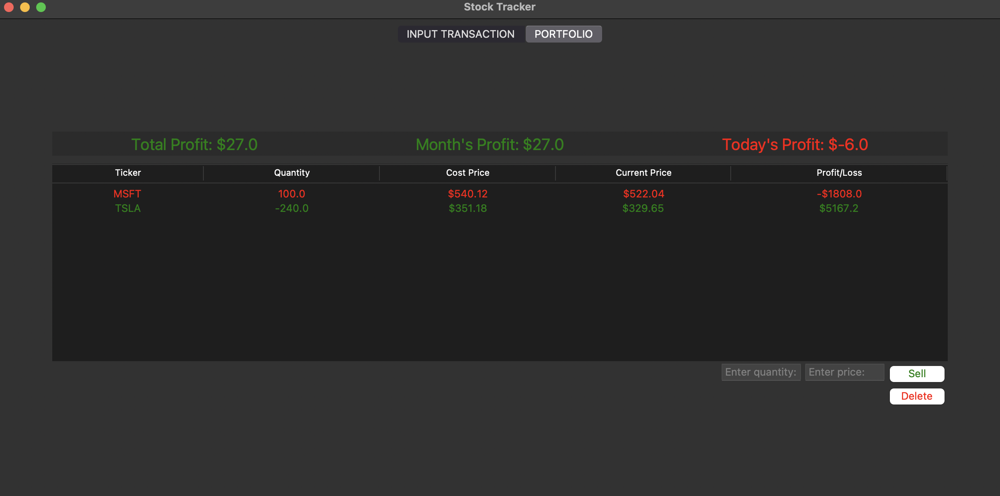

# Stock Tracker

A desktop GUI app to track stock purchases, shorts, and calculate profits in real time using Yahoo Finance data.

## Features

- Add buy or short transactions
- Track remaining shares
- See profit/loss in real time
- Store data locally in SQLite
- Simple GUI with Tkinter

## Installation

1. Clone this repository:

```bash
git clone https://github.com/RianMehta21/stock-tracker.git
cd stock-tracker
```

2. Install dependencies:

```commandline
pip install -r requirements.txt
```

3. Run the progam

```commandline
python app.py
```

## Screenshots

### Input Transaction Tab

Form for recording new **BUY** or **SHORT** trades. The ticker needs to match Yahoo Finance. If there are invalid
inputs, an **error message** will display.


### Portfolio Tab

Displays active positions with real-time prices and profit/loss. Allows **deletion** of a transaction by inputting the
quantity you want to sell and the price you are selling at. The **profits** at the top will update accordingly. If the
inputs are invalid, an **error message** will display accordingly.

